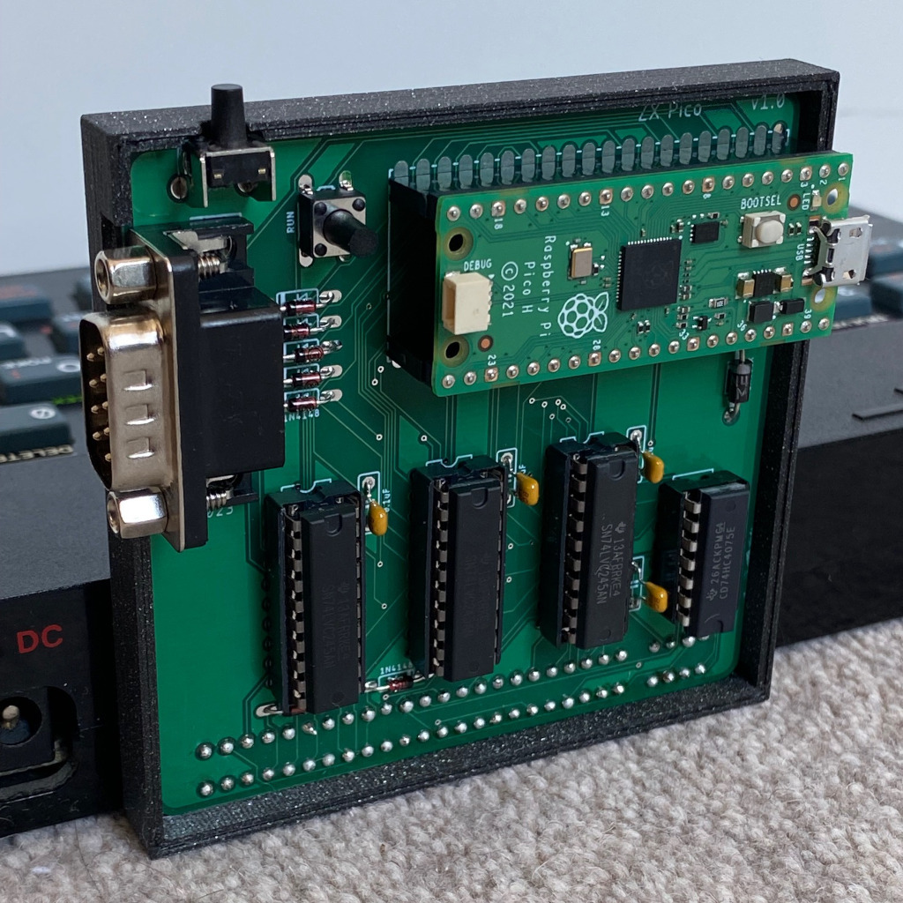
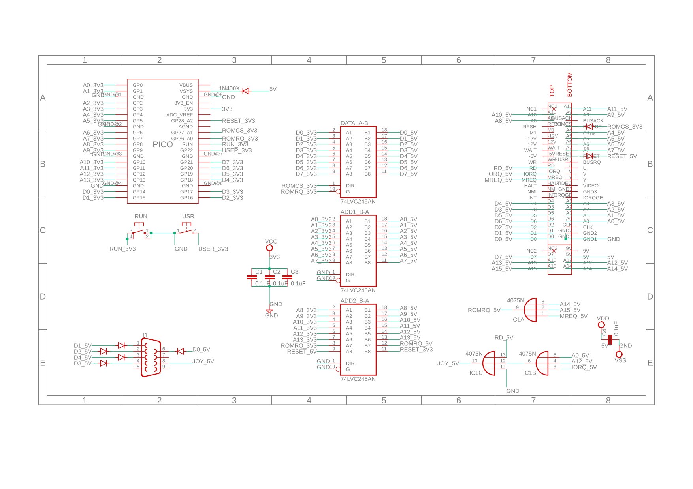
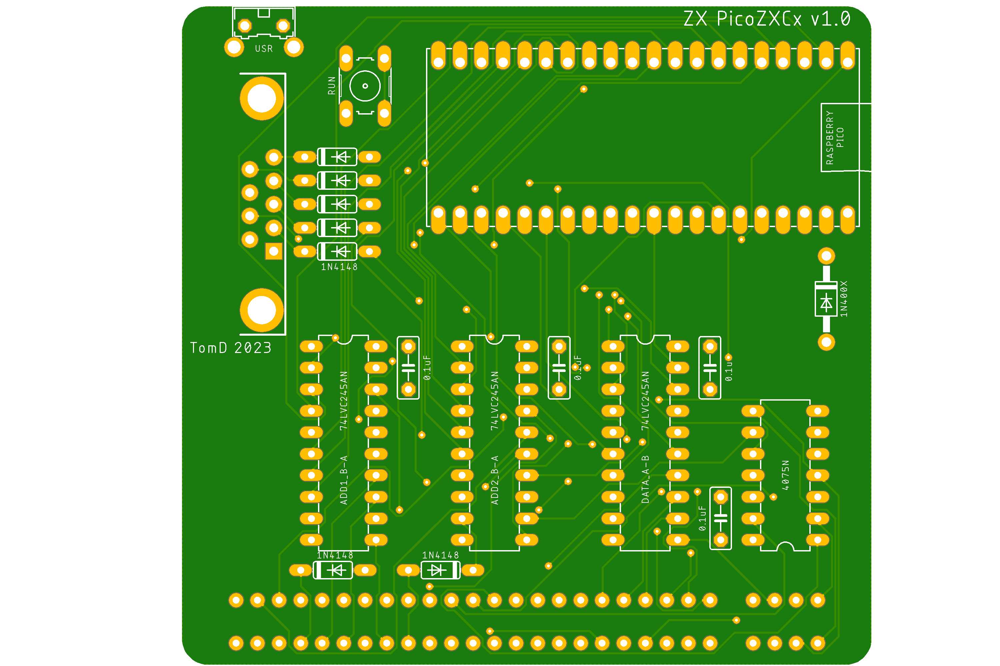
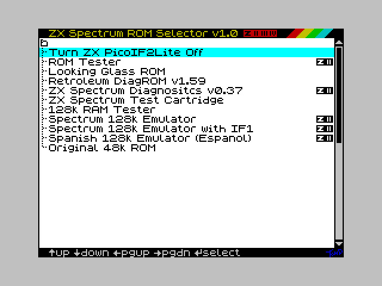
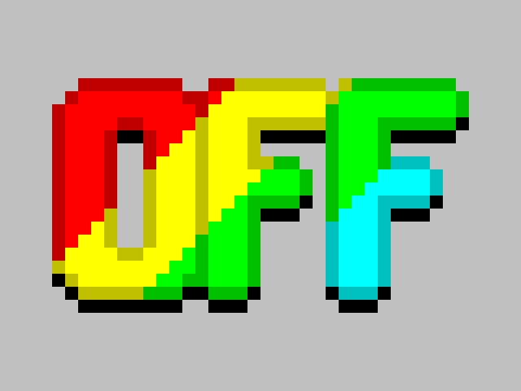
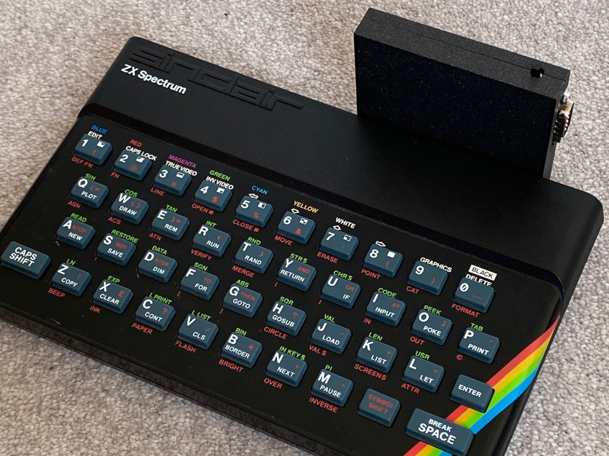
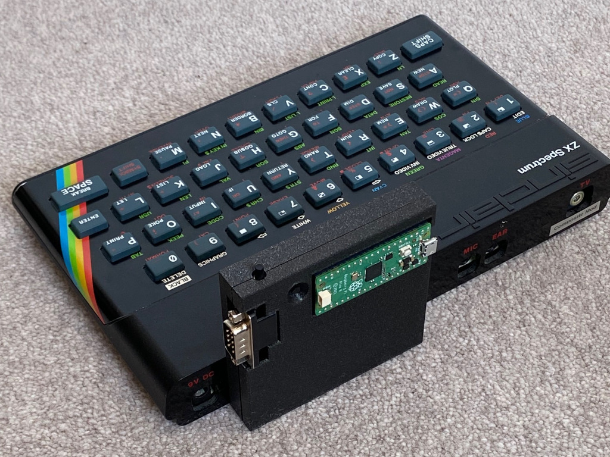

# ZX PicoIF2Lite
Sinclair Interface 2 replacement including ROM Cartridge emulation using a Raspberry Pico.

The main purpose of this interface is to replicate the [Sinclair Interface 2](https://en.wikipedia.org/wiki/ZX_Interface_2), adapting the original Pico ROM design by [Derek Fountain](https://github.com/derekfountain/zx-spectrum-pico-rom). Derek's idea was to use the Pico's flash memory in place of the ROM cartridges and I adapted this slightly to use the PiO rather than bit-banging, to use through hole components as easier to build, and to also to include a joystick port. 

One of the main issues I had with the original design was it always had to have a ROM paged in, with the ROMCS line permanently attached to 5V. This made it difficult to use shadow ROMs like with an Interface 1, and basically meant adding functionality to the Pico to page in the IF1 ROM when needed. It also wasn't great on a 128k machine as it stopped the editor being useable. I therefore altered the design to be able to control the ROMCS line using the Pico which meant the unit could be disabled. This did mean losing the M1 line read but this is how the original IF2 was designed.

## The Interface 

The Interface is very simple with the Pico doing most of the heavy lifting. I've used 74LVC245 bus transceivers (as per Derek's original) to level shift both the address line (A0-A13) and data line (D0-D7) between the Pico and the edge connector. These chips also have the advantage of a high impedence mode when they are not required, something used on data line when the ROM isn't being accessed. The other chip in the circuit is a 4075 tri-input OR chip which is used to combine the A14, A15 & MREQ signals, which is basically indicating a ROM access. As the 4075 has three logic units I've also used this for the joystick.

Power for the Pico is provided by the 5V of the Spectrum via the edge connector, protected by a diode. There is also a run button and a user button which is used to control the Pico behaviour. More details of this are below.

## The Joystick
Includes a simple 9pin joystick connector (DE-9 often referred to as DB-9), wired to Atari pinout and mapped to Sinclair 1 (67890). Note this is a simple hardware implementation inspired by the [Shadow of the Unicorn Interface](https://www.pcbway.com/project/shareproject/Mikro_Gen_Shadow_of_the_Unicorn_interface_Modern_re_creation_for_Sinclair_Spectrum.html) using diodes rather than the Pico (not enough GPIOs) or an inverter chip which most other interfaces use. As a result 5V is not sent to the adapter and autofire functions of some joysticks do not work. This is most likely due to the lack of a constant ground signal, normal fire and directions work fine.

The joystick circuit is pretty basic, it uses the 4075 OR chip to pull the GND pin of the joystick low when RD, A0, A12 & IORQ are low, high when any of them isn't low. This is basically simulating when the Spectrum is reading 67890 on the keyboard. If the output from the OR chip is low then if you move the joystick or press fire it grounds one of the data lines, either D0, D1, D2, D3 or D4. This creates the correct bit pattern for a IN 0xfe read on the Spectrum. Diodes protect the data line so it literally only zeros the bits when they are needed. I beleive it is the fact that the ground pin of the joystick isn't constant that autofire circuits don't work.

### Version Control
- v0.2 changes to improve ZXC compatibility, added zxcOn true/false ** Latest Version
- v0.1 initial release taken form PicoIF2ROM but with interrupt driven user button

## Usage
Usage is very simple. On every cold boot the Interface will be off meaning the Spectrum will boot as if nothing attached. To activate the interface press and hold the user button for >1second, the Spectrum will now boot into the ROM Explorer. If you just want to reset the Spectrum just press the user button and do not hold down. The ROM Explorer is very easy to use and is in the style of a standard File Explorer. User the cursor/arrow keys to navigate the ROMs and enter to select one. ROMs with icons to the right hand side indicate they will launch with ZXC compatibility. More details of the ROM Explorer can be found below.

## Building an Interface
I've provided everything you need to build your own Interface below, including the Gerbers for getting the PCBs made. I've also provided all the code so you can add your own ROMs and compile the necessary files to load onto the Pico. For details on how to set-up a build environment please refer to the [Raspberry Pico SDK documentation](https://www.raspberrypi.com/documentation/pico-sdk/)

Once built, load the UF2 file onto the Pico and boot the Spectrum. Hopefully all works fine.

### The Schematic

### The PCB

All the files needed to make your own PCB are in the [Gerbers folder](./gerbers/), zipped.

### Bill of Materials (BoM)
- 1x [Raspberry Pico](https://shop.pimoroni.com/products/raspberry-pi-pico?variant=40059364311123). Recommend H variant as header pre-soldered.
- 3x [SN74LVC245AN Octal Bus Transceiver With 3-State Outputs](https://www.mouser.co.uk/ProductDetail/595-SN74LVC245AN). Note these need to be the LVC variant to work with the 3v3 of the Pico.
  - Optional 2x10pin sockets
- 1x [CDx4HC4075 Triple 3-Input OR Gates](https://www.mouser.co.uk/ProductDetail/595-CD74HC4075EE4) or equivalent.
  - Optional 2x7pin socket
- 4x [100nF/0.1uF Capacitor](https://www.mouser.co.uk/ProductDetail/Vishay-BC-Components/K104K15X7RF5TH5?qs=CuWZN%2F5Vbiofhf%252BuZNGw%2Fg%3D%3D)
- 7x [1N4148 Diode](https://www.mouser.co.uk/ProductDetail/onsemi-Fairchild/1N4148?qs=i4Fj9T%2FoRm8RMUhj5DeFQg%3D%3D)
- 1x [1N4001 Diode](https://www.mouser.co.uk/ProductDetail/Rectron/1N4001-B?qs=%252BtLcN0raKGUACwkD5chVvg%3D%3D). Can also use Schottky equivalent and 1A probably overkill but 1N4001 are fine and easy to get hold of, voltage drop isn't an issue with this circuit.
- 1x [56pin PCB Edge Connector](https://www.ebay.co.uk/sch/i.html?_from=R40&_trksid=p2047675.m570.l1313&_nkw=zx+spectrum+edge+connector&_sacat=0). Needs both ends cutting off, the pins removing top & bottom at position 5 and a piece of plastic or metal inserting for the slot (see [ZX Spectrum Edge Connector](https://i0.wp.com/projectspeccy.com/documents/ZXSpectrum_Edge_Connector_Diagram_48K.jpg)). This ensures everything aligns when connecting.
- 2x [20pin female header sockets](https://www.ebay.co.uk/sch/i.html?_from=R40&_trksid=p2380057.m570.l1313&_nkw=20pin+female+header+socket&_sacat=0)
- 1x [6x6x9mm Right Angled PCB Momentary Push Button](https://www.ebay.co.uk/sch/i.html?_from=R40&_trksid=p2380057.m570.l1313&_nkw=6x6x9mm+Right+Angled+PCB+Momentary+Push+Button&_sacat=0)
- 1x [6x6x9mm PCB Momentary Push Button](https://www.ebay.co.uk/sch/i.html?_from=R40&_trksid=p2334524.m570.l1313&_nkw=6x6x9mm+PCB+Momentary+Push+Button&_sacat=0&LH_TitleDesc=0&_osacat=0&_odkw=6+x+6+x9mm+right+angled+pcb+momentary+push+button)
- 1x [DE9 9pin Male PCB Connector](https://www.ebay.co.uk/sch/i.html?_from=R40&_trksid=p2334524.m570.l1313&_nkw=db9+9pin+pcb+male+connector&_sacat=0&LH_TitleDesc=0&_osacat=0&_odkw=db9+9pin+pcb+male+connector)

## The ROMs
For demonstration purposes I have included the following ROMs, if you are the owner of this ROM and do not want it including please just contact me and I'll remove it:
- Original ZX Spectrum ROM (copyright Amstrad)
- [Retroleum DiagROM v1.59 by Retroleum](http://blog.retroleum.co.uk/electronics-articles/a-diagnostic-rom-image-for-the-zx-spectrum/)
- [ZX Spectrum Diagnostics v0.37 by Brendan Alford](https://github.com/brendanalford/zx-diagnostics/releases/tag/v0.37)
- ZX Spectrum Test Cartridge (copyright Amstrad)
- [128k RAM Tester by Paul Farrow](http://www.fruitcake.plus.com/Sinclair/Interface2/Cartridges/Interface2_RC_New_RAM_Tester.htm)
- [Looking Glass ROM by Geoff Wearmouth as used on the Spectrum Next](https://gitlab.com/thesmog358/tbblue/-/tree/master/machines/next)
- [Spectrum 128k Emulator by Paul Farrow](http://www.fruitcake.plus.com/Sinclair/Interface2/Cartridges/Interface2_RC_New_Spectrum_128.htm)
- [Spanish 128k Emulator by Paul Farrow](http://www.fruitcake.plus.com/Sinclair/Interface2/Cartridges/Interface2_RC_New_Spanish_128.htm)
- [Spectrum ROM Tester by Paul Farrow](http://www.fruitcake.plus.com/Sinclair/Interface2/Cartridges/Interface2_RC_New_ROM_Tester.htm)

### Adding your own ROMs
To add your own ROMs you need to first create a binary dump of the ROM (or just download it) and convert that into a `uint8_t` array to put in the `roms_lite.h` header file. I've written a little utility to do this called `compressROM`. This utility uses a very simple compression algorithm to reduce the size of the ROMs which helps if you want to add a loads of them (max 126). After compressing the utility creates the appropriate header file structure to paste into `roms_lite.h`.

Once you've added the ROM to `roms_lite.h` you then need to add details about the ROM to the `picozxcx_lite.h` header file. This is in four parts.
1. name of the array
2. whether you need to enable ZXC compatibility
3. the description to show in the ROM selector (max 32chars)
4. Set the `MAXROMS` number to match the number of ROMs

Use the examples in the header file already as a guide.

## ZXC2 Compatibility
While researching how to get the 128k ROM editor working on the device, before the ROMCS change, I remembered [Paul Farrow's FruitCake website](http://www.fruitcake.plus.com/Sinclair/Interface2/Interface2_ResourceCentre.htm) and the numerous cartridges and ROMs he had created. Some of those ROMs require software based bank switching and also for the unit to be disabled. Now that I could control the ROMCS line it was relatively easy to adapt the Pico code so that it could be compatible with Paul's ZX2 device. As ZX2 compatibility isn't always desirable, due to it constantly scaning the top 64kB of ROM untill you tell it not to, I added a toggle so that you can chose whether you want ZX2 compatibility or just run the unit as originally intended.

As of v0.2 the interface has ZXC2 compatibility allowing bank paging, turning off of the ROM and locking the paging. Full details of Paul's ZXC2 design and how it works can be found on [Paul Farrow's website](http://www.fruitcake.plus.com/Sinclair/Interface2/Cartridges/Interface2_RC_ZXC2.htm). Below is a quick summary of how I've implemented it using the Pico:

When in ZXC compatibility mode, the Pico will scan each ROM address memory request. If the memory request is in the top 64bytes (`0x3fc0-0x3fff`) the Pico will do one of the following:
- If address bit 5 is on (1) the Pico will prevent further paging, basically locking the interface. This lock cannot be reversed via software and needs the user (reset) button pressing. Note you can still get into the ROM swap menu by pressing and holding the user button, this simply stops the software paging from working.
- If address bit 4 is on (1) the Pico will page out the interface ROM paging in the Spectrum ROM
- If address bit 4 is off (0) the Pico will page in the interface ROM, paging out the Spectrum ROM
- Address bits 0-3 are used to determine which ROM to page in, 0 is ROM 0, 5 is ROM 5 etc... I've set-up the Pico to mimic a 128k EPROM which allows for 8 banks/pages. 
  - To use this you need to create a single ROM binary with all the ROMs you want to swap in/out using the ZXC commands. 
  - The Spectrum 128k emulator ROM on Paul's website is a 32kB or 48kB ROM as an example. You don't need to split this into 2 or 3 16kB ROMs, just load the whole thing.
 
Currently supports normal and ZXC2 cartridges only. ZX2 compatibility was tested with [Spectrum ROM Tester](http://www.fruitcake.plus.com/Sinclair/Interface2/Cartridges/Interface2_RC_New_ROM_Tester.htm), [Spectrum 128k Emulator (with & without IF1)](http://www.fruitcake.plus.com/Sinclair/Interface2/Cartridges/Interface2_RC_New_Spectrum_128.htm) and [Spanish 128k Emulator](http://www.fruitcake.plus.com/Sinclair/Interface2/Cartridges/Interface2_RC_New_Spanish_128.htm)

## The ROM Selector
In order to swap between all the different ROMs the interface needs a simple ROM Selector utility which runs on the Spectrum. Once this has launched the Pico will constantly monitor the top of ROM memory, so to pick a ROM all the Spectrum code needs to do is loop over a memory read at the correct location between `0x3f80` and `0x3fff`. For example `0x3f80` is ROM 0, `0x3f96` is ROM 22. If a ROM is selected which doesn't exist the code will just pick the last ROM.

I've provided a fully working ROM Explorer program, in the style of File Explorer, which does exactly this. You can easily replace this with your own if you wish and I've highlighted the relavent sections in the code which need replacing.

You can also use the selector to turn the device off, which pages in the Spectrum ROM, especailly useful on 128k machines or if you want to use external devices with shadow ROMs i.e. Interface 1.

## The Case
I've created a 3D Printed Case for the interface. This makes it a lot easier to attach and remove from the Spectrum. You can download the STLs on [Thingiverse](https://www.thingiverse.com/thing:6074475)

