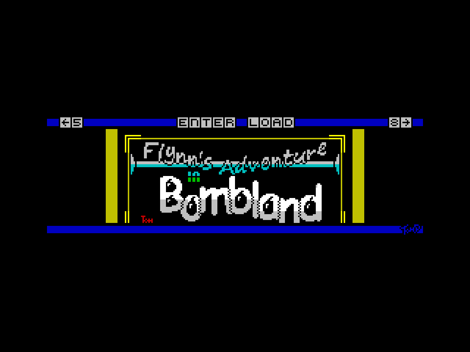
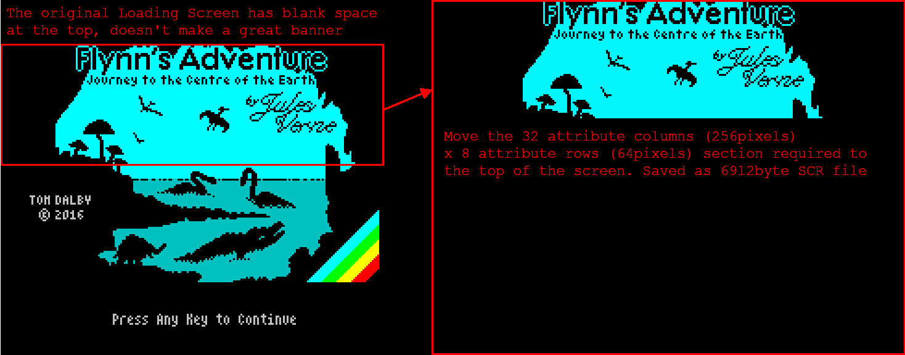

# ZX PicoIF2Lite Carousel Edition

Based on v0.6 of ZX PicoIF2Lite ([see main branch](https://github.com/TomDDG/ZXPicoIF2Lite/tree/main)) this is a minimalistic version of the original allowing the device to be used to only load Z80 or SNA snapshots via a simple carousel. The carousel displays 256pixels x 64pixel (32x8 attibutes) banners in the middle of the screen to identify which snapshot is being loaded. 

Usage is very simple. On every cold boot the Interface will be off meaning the Spectrum will boot as if nothing attached. To activate the interface press the user button, the Spectrum will now boot into the Carousel. The Carousel is very easy to use with the keys 5 for left, 8 for right and enter to load. The attached joystick left, right and fire also works.

Using the supplied ````buildheader```` software you simply tell it which snapshots you want to include and it will create the carousel. Minimum number of snapshots is 2 and maximum is 16. It will also tell you if there isn't any memory left so you might not be able to fit all 16.



Once selected the Carousel will load the snapshot using the ROM loader. I've included an example header file ````picoif2lite.h```` with a selection of my games.

## Build Header Software

The supplied ````buildheader```` software creates the header file using the input Z80 or SNA snapshots. It will create a carousel with either a default or supplied screen (default shown above), and banners created either automatically from the snapshot or using a supplied screen.

````
buildheader <carousel.scr> infile1.z80/sna <infile1.scr> infile2.z80/sna <infile2.scr> ... infile16.z80/sna <infile16.scr>
````
The tool allows you to replace the default carousel screen and also the banner from each snapshot. Both 48k & 128k snapshots are supported and ````scr```` files have to be ZX Spectrum layout 6912byte files.

## Building Banners

The ````buildheader```` software will create banners for each snapshot from the initial screen, usually the loading screen. This is taken from the top 8 attribute rows (64 pixels). Sometimes this will be ok, sometimes you will be better creating a custom banner. To do this simply create a new screen with the top 8 rows being the banner. Example shown:



## Building Replacement Carousel Screen

This simply needs to be a full screen 6912byte ZX Spectrum layout ````.scr```` file. I use ````SevenUp```` to create mine but there are other packages available. The screen needs to have a 256x64 pixel cutout in the centre for the snapshot bannners, see the example banner above. I've included an example ````examplecarousel.scr```` file to edit.

## Building UF2 Tips

Make sure cmake is set to ````Release```` and I recommend SDK v2.2.0 as it supports ````PICO_USE_FASTEST_SUPPORTED_CLOCK=1```` which I've added to ````CMakeLists.txt```` to run the Pico at the new 200MHz rated speed. This helps the Pico keep up with the ZX Spectrum address & data bus.

## Version Control
- v0.7 Release version based on v0.6 of ZX PicoIF2Lite


